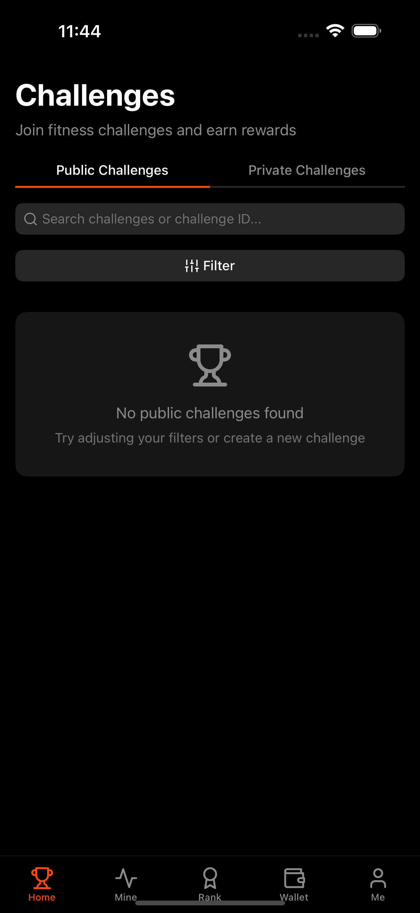

# FitStake - Get Fit, Stake SOL, Earn Rewards! 💪💰



[](https://docs.expo.dev/)
[](https://solana.com/)
[](https://nodejs.org/)

## Turn Your Fitness Journey into Financial Rewards!

FitStake revolutionizes fitness motivation by combining exercise with cryptocurrency rewards. Stake SOL tokens on fitness challenges, complete your goals, and earn rewards - all secured by blockchain technology!

## 📱 Project Structure

The project consists of three main parts:

- **fitstake-expo**: Mobile app built with Expo/React Native
- **fistake-backend**: Node.js/Express backend API
- **fitstake-contracts**: Solana smart contracts using Anchor framework

## 🚀 Getting Started

### Prerequisites

- Node.js v18 or later
- Yarn or npm
- Expo CLI
- Solana CLI
- Anchor Framework
- iOS/Android device or simulator

### Setup and Installation

1. **Clone the repository**

```bash
git clone https://github.com/aryan877/FitStake
```

2. **Set up environment variables**

Create `.env.local` files based on the provided examples in each directory.

3. **Install dependencies**

```bash
# Install dependencies for all projects
cd fitstake-expo && npm install
cd ../fistake-backend && npm install
cd ../fitstake-contracts && npm install
```

## 📱 Mobile App (fitstake-expo)

The mobile app allows users to:

- Connect with Privy wallet
- Track step counts via health APIs
- Join and create fitness challenges
- Stake SOL on challenges
- Monitor progress and claim rewards

### Privy Configuration

Both the mobile app and backend require Privy API keys for authentication:

#### Mobile App (.env.local)

```
EXPO_PUBLIC_PRIVY_APP_ID=your_privy_app_id
EXPO_PUBLIC_PRIVY_CLIENT_ID=your_privy_client_id
```

#### Backend (.env)

```
PORT=5000
MONGODB_URI=your_mongodb_connection_string
PRIVY_APP_ID=your_privy_app_id
PRIVY_SECRET=your_privy_secret_key
PRIVY_VERIFICATION_KEY="-----BEGIN PUBLIC KEY-----
Your Privy verification public key goes here
-----END PUBLIC KEY-----"
```

You can obtain the Privy credentials by signing up at [Privy.io](https://privy.io) and creating a new application. For MongoDB, you'll need a MongoDB Atlas account or a local MongoDB server.

### Running the App

```bash
cd fitstake-expo
npm run dev
```

For iOS:

```bash
npm run ios
```

For Android:

```bash
npm run android
```

### Development Client Setup

For development with custom modules, you'll need to build a development client:

```bash
# Install EAS CLI if not already installed
npm install -g eas-cli

# Build the development client
cd fitstake-expo
eas build --profile development --platform ios  # For iOS
# OR
eas build --profile development --platform android  # For Android
```

After building, you can run the development client on your device or simulator.

## 🖥️ Backend (fistake-backend)

The backend handles:

- User authentication
- Challenge management
- Health data verification
- Solana blockchain interactions
- Badge and achievement systems

### Running the Backend

```bash
cd fistake-backend
npm run dev
```

### Admin Management

Administrators in the application have one key privilege:

- Creating public challenges that are accessible to all users

Regular users can only create private challenges that require an invitation code to join, while admin users can create challenges that are visible and joinable by anyone on the platform.

#### Making a User an Admin

To grant admin privileges to a user:

```bash
cd fistake-backend
npm run make-admin <username or wallet address>
```

The script will:

1. Connect to the MongoDB database
2. Find the user by the provided identifier
3. Update the user's `isAdmin` field to `true`
4. Save the changes to the database

#### Removing Admin Privileges

To remove admin status from a user:

```bash
cd fistake-backend
npm run remove-admin <username or wallet address>
```

The script performs similar steps as the makeAdmin script but sets the `isAdmin` field to `false`.

## ⛓️ Smart Contracts (fitstake-contracts)

The Solana smart contracts manage:

- Challenge creation and verification
- Stake management
- Reward distribution
- On-chain record keeping

### Building and Deploying Contracts

```bash
cd fitstake-contracts
./build-deploy-copy.sh
```

This script will:

1. Build the Anchor contracts
2. Deploy to Solana devnet
3. Copy the IDL and keypair files to the frontend and backend

## 🔄 Workflow

The typical workflow for the application:

1. User creates or joins a challenge via the mobile app
2. User stakes SOL tokens on the challenge
3. User tracks fitness activity through health APIs
4. Backend verifies fitness data
5. Smart contracts manage staking and rewards
6. User completes challenge and claims rewards

## 🤝 Contributing

Contributions are welcome! Please feel free to submit a Pull Request.

## 📄 License

This project is licensed under the MIT License - see the LICENSE file for details.

## 🛠️ Tech Stack

- **Frontend**: React Native, Expo, TypeScript, Privy for authentication
- **Backend**: Node.js, Express, MongoDB, TypeScript
- **Blockchain**: Solana, Anchor framework
- **Health Data**: Expo Health Connect, Google Fit, Apple HealthKit
